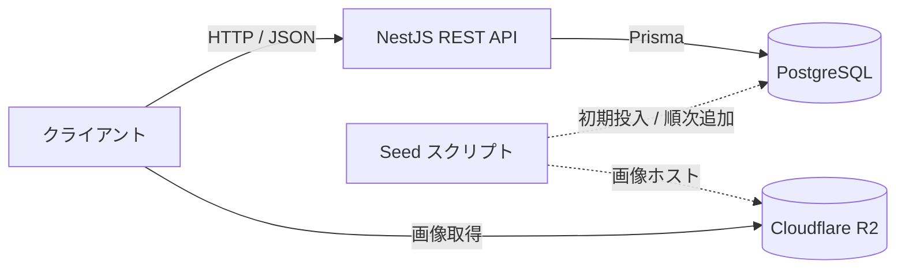

# 基本設計書（V1）

| 項目 | 内容 |
| --- | --- |
| プロジェクト名 | 世界の名ビーチ API |
| 文書バージョン | 1.0 |
| 対象スコープ | V1 |
| 作成日 | 2026-06-30 |
| 作成者 | 本人（個人開発） |
| 承認者 | 本人（個人開発） |
| ステータス | ドラフト |

---

## 改訂履歴

| バージョン | 日付 | 変更者 | 変更内容 |
| --- | --- | --- | --- |
| 1.0 | 2026-06-30 | 本人 | 初版作成 |

---

## 1. はじめに

### 1.1 目的
本書は「世界の名ビーチ API」V1 の **基本設計（外部設計）** を定義する。外から見たAPIの振る舞い（エンドポイント・入出力・エラー）と、データ設計・データ投入（seed）設計を確定することを目的とする。

### 1.2 適用範囲
本書は外部設計とデータ設計を対象とする。クラス・関数レベルの内部実装（詳細設計）は NestJS の定石構成（module / controller / service / DTO）に従うものとし、本書では文書化しない。

### 1.3 関連文書

| 文書名 | 保管場所 |
| --- | --- |
| 要件定義書（V1） | `docs/requirements.md` |

---

## 2. システム構成

### 2.1 アーキテクチャ



- ランタイムでの外部API呼び出しはない。画像はクライアントが R2 から直接取得する。
- データは seed スクリプトでDBへ投入する（読み取り専用・admin画面なし）。

### 2.2 技術スタック

| 区分 | 採用 |
| --- | --- |
| 言語 | TypeScript |
| フレームワーク | NestJS |
| DB | PostgreSQL |
| ORM | Prisma |
| バリデーション | class-validator / class-transformer |
| APIドキュメント | @nestjs/swagger（OpenAPI 自動生成） |
| seed 実行 | tsx |
| 画像ホスティング | Cloudflare R2 |

### 2.3 レイヤ構成

NestJS の標準構成に従う。`Beach` 単一リソースのため、1モジュールで完結する。

| レイヤ | 役割 |
| --- | --- |
| Controller | ルーティング・リクエスト受け取り・DTOバリデーション |
| Service | ビジネスロジック・Prisma 呼び出し |
| Prisma（DBアクセス） | クエリ発行 |
| DTO | クエリパラメータの型・バリデーション定義 |

---

## 3. API共通仕様

### 3.1 ベースURL・バージョニング
- ベースパス：`/api/v1`
- 破壊的変更が生じる場合のみ `/api/v2` を切る（V1では `v1` 固定）。

### 3.2 リクエスト共通
- メソッド：参照系のみ（`GET`）。
- クエリパラメータは `class-validator` で検証し、不正な型・範囲は `400` を返す。
- CORS：公開APIのため許可オリジンを設定する（許可オリジンは環境変数で管理）。

### 3.3 レスポンス共通
- 形式：JSON（`Content-Type: application/json`）。
- 一覧系：`data`（配列）＋ `meta`（ページ情報）。
- 個別系：単一オブジェクト（`data` でラップしない）。
- 未投入の任意フィールドは省略せず `null` で返す（V1の必須フィールド構成では原則発生しない）。

### 3.4 ステータスコード

| コード | 用途 |
| --- | --- |
| 200 OK | 取得成功（0件ヒットの一覧含む） |
| 400 Bad Request | クエリパラメータの型・範囲が不正 |
| 404 Not Found | 指定 slug のビーチが存在しない |
| 500 Internal Server Error | サーバ内部エラー |

### 3.5 エラー形式
NestJS 標準の例外フィルタ形式に統一する。

```json
{
  "statusCode": 404,
  "message": "Beach not found",
  "error": "Not Found"
}
```

---

## 4. エンドポイント詳細

### 4.1 一覧取得 `GET /api/v1/beaches`

ビーチの一覧をページ単位で返す。

**クエリパラメータ**

| 名前 | 型 | 必須 | 既定 | 制約 | 説明 |
| --- | --- | --- | --- | --- | --- |
| `country` | string | - | - | - | 国名で絞り込み（完全一致・大文字小文字無視） |
| `page` | integer | - | 1 | 1以上 | ページ番号 |
| `limit` | integer | - | 20 | 1〜100 | 1ページ件数（超過時は100に丸め） |

**バリデーション規則**
- `page`：整数・1以上。範囲外や非整数は `400`。
- `limit`：整数・1以上。100超は100に丸める。
- `country`：文字列。前後空白はトリム。

**並び順**：`id` 昇順（固定）。

**レスポンス（200）**

```json
{
  "data": [
    {
      "id": 1,
      "slug": "grande-anse-la-digue",
      "name": "グランダンス・ビーチ",
      "nameEn": "Grande Anse Beach",
      "country": "Seychelles",
      "description": "...(日本語の紹介文)...",
      "imageUrl": "https://cdn.example.com/beaches/grande-anse-la-digue.jpg"
    }
  ],
  "meta": { "total": 24, "page": 1, "limit": 20, "totalPages": 2 }
}
```

**業務ルール／例外**
- `country` 該当0件：空配列で `200`（エラーとしない）。
- `page` が総ページ数超過：空配列で `200`。
- 有効な `country` 値（取りうる国名一覧）は Swagger に記載する。

### 4.2 個別取得 `GET /api/v1/beaches/:slug`

slug を指定して1件を返す。

**パスパラメータ**

| 名前 | 型 | 必須 | 説明 |
| --- | --- | --- | --- |
| `slug` | string | ✓ | ビーチの一意識別子 |

**レスポンス（200）**：単一の `Beach` オブジェクト（4.1 の `data` 要素と同形）。

```json
{
  "id": 1,
  "slug": "grande-anse-la-digue",
  "name": "グランダンス・ビーチ",
  "nameEn": "Grande Anse Beach",
  "country": "Seychelles",
  "description": "...(日本語の紹介文)...",
  "imageUrl": "https://cdn.example.com/beaches/grande-anse-la-digue.jpg"
}
```

**業務ルール／例外**
- 該当 slug が存在しない：`404 Not Found`。

---

## 5. データ設計

### 5.1 テーブル定義（Beach）

| カラム | 型 | NULL | 制約 | 説明 |
| --- | --- | --- | --- | --- |
| `id` | Int | NOT NULL | PK / autoincrement | 内部ID |
| `slug` | String | NOT NULL | UNIQUE | URL用識別子 |
| `name` | String | NOT NULL | - | 日本語名 |
| `nameEn` | String | NOT NULL | - | 英語名 |
| `country` | String | NOT NULL | - | 国名（英語） |
| `description` | Text | NOT NULL | - | 紹介文（日本語・主コンテンツ） |
| `imageUrl` | String | NOT NULL | - | 画像URL（R2 の配信URL） |
| `createdAt` | DateTime | NOT NULL | default(now) | 作成日時 |
| `updatedAt` | DateTime | NOT NULL | updatedAt | 更新日時 |

### 5.2 インデックス

| 対象 | 種別 | 目的 |
| --- | --- | --- |
| `slug` | UNIQUE | 個別取得・upsert キー |
| `country` | INDEX | 国フィルタの検索 |

### 5.3 Prisma スキーマ

```prisma
model Beach {
  id          Int      @id @default(autoincrement())
  slug        String   @unique
  name        String
  nameEn      String
  country     String
  description String   @db.Text
  imageUrl    String
  createdAt   DateTime @default(now())
  updatedAt   DateTime @updatedAt

  @@index([country])
}
```

---

## 6. データ投入（seed）設計

### 6.1 方針
- データ正本はリポジトリ内のファイルとし、DBはそれを投入した再現可能なコピーとする。DBへ直接書き込まない。
- V1 は単一ファイル `prisma/beaches.ts`（TS配列）で管理する。件数が増えて重くなった場合は国別ファイルへ分割するが、seed 本体のループは変更しない。
- 画像の実体（バイナリ）はリポジトリに置かず R2 にホストし、ファイルには配信URLのみ保持する。

### 6.2 ファイル構成

```
prisma/
  schema.prisma
  seed.ts        ← 正本を読み込み upsert
  beaches.ts     ← データ正本（TS配列）
```

### 6.3 投入仕様
- `slug` をキーに **upsert**（存在すれば更新、なければ作成）。
- データを1件追記して再実行しても重複・全削除が起きない（順次追加に対応）。
- ファイルから削除した行はDBから自動削除されない（必要時のみ手動対応）。

### 6.4 実行
- `package.json` の `prisma.seed` に `tsx prisma/seed.ts` を登録。
- 実行コマンド：`npx prisma db seed`。
- デプロイ時：`prisma migrate deploy` → `prisma db seed`。

### 6.5 データ調達
- 紹介文（`description`）：自前作成（既存メディアの流用禁止）。
- 名称・国（`name` / `country`）：公開情報を自分で確認して記載（事実に著作権はない）。
- 画像（`imageUrl`）：Unsplash から手動ダウンロードし R2 へホスト。人物・ブランドの写り込みは不採用。

---

## 7. 横断的設計

| 項目 | 設計 |
| --- | --- |
| ページネーション | `page` / `limit` 方式。`meta` に `total` / `page` / `limit` / `totalPages` を返す |
| ソート | `id` 昇順固定（ページ間で順序を安定させる） |
| 国フィルタ | 英語 `country` 値への完全一致・大文字小文字無視 |
| バリデーション | `class-validator` でクエリDTOを検証。違反は `400` |
| エラーハンドリング | NestJS 例外フィルタで統一形式に整形 |
| APIドキュメント | `@nestjs/swagger` で OpenAPI を自動生成 |
| CORS | 許可オリジンを環境変数で設定 |
| 設定値 | DB接続情報・許可オリジン・R2 のドメインは環境変数（`.env`、Git管理外） |

---

## 8. スコープ外

| No | 対象外事項 | 備考 |
| --- | --- | --- |
| 1 | 詳細設計（クラス図・関数仕様） | NestJS 定石構成に従い、コードに委ねる |
| 2 | 認証・認可 / 書き込み系API | 読み取り専用のため |
| 3 | 緯度経度・地図・近接検索 | 読み物として対象外 |
| 4 | 全文検索 / タグ / 多言語 | V1スコープ外 |
| 5 | デプロイ先・インフラ詳細 | 別途決定 |
