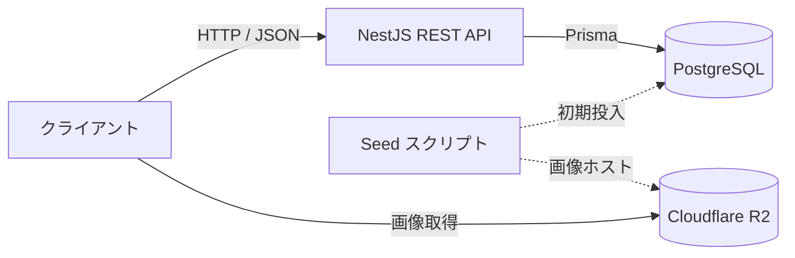

# 要件定義書（V1）

| 項目 | 内容 |
| --- | --- |
| プロジェクト名 | 世界の名ビーチ API |
| 文書バージョン | 1.0 |
| 対象スコープ | V1 |
| 作成日 | 2026-06-30 |
| 作成者 | 本人（個人開発） |
| 承認者 | 本人（個人開発） |
| ステータス | ドラフト |

---

## 改訂履歴

| バージョン | 日付 | 変更者 | 変更内容 |
| --- | --- | --- | --- |
| 1.0 | 2026-06-30 | 本人 | 初版作成 |

---

## 1. はじめに

### 1.1 目的
本書は「世界の名ビーチ API」の **V1** で実現すべき要件を定義することを目的とする。あわせて、本プロジェクトが NestJS / PostgreSQL / Prisma を用いたバックエンド開発の学習およびポートフォリオを主目的とすることを前提とする。

### 1.2 適用範囲
本書は V1 のバックエンド（データモデル、エンドポイント設計、データ調達方針）を対象とする。フロントエンドの実装およびインフラ構築の詳細は対象外とする。

### 1.3 用語の定義

| 用語 | 説明 |
| --- | --- |
| 読み物API | 紹介文（テキスト）を主コンテンツとし、地図・地理機能を持たないAPIの位置づけ |
| slug | URLで使用する人間可読な一意識別子（例：`grande-anse-la-digue`） |

---

## 2. プロジェクト概要

### 2.1 背景・課題
世界の著名なビーチの情報は、各メディア（CNN、Tripadvisor、Lonely Planet など）に散在しており、選定基準や順位もばらばらで、機械可読な統一データソースが存在しない。さらに主要なリストの一部は更新が停止している（例：CNN「World's 100 best beaches」は2013年初出で以降ほぼ更新がない）。

本プロジェクトは、著名なビーチを独自にキュレーションし、統一されたREST APIとして「読み物」コンテンツ（紹介文を主とする情報）を提供する。

### 2.2 目的・ゴール
- 著名なビーチの紹介文を主としたREST APIを提供する（一覧・個別・国フィルタ）。
- データは順次追加していく。
- NestJS / PostgreSQL / Prisma の実装スキルを習得し、ポートフォリオとする。

### 2.3 期待効果（KPI）

| 指標 | 現状 | 目標 |
| --- | --- | --- |
| 提供ビーチ件数 | 0件 | 順次追加していく |
| 習得技術 | - | NestJS 基礎（CRUD）/ Prisma / フィルタ・ページネーションの実装経験 |
| 公開状態 | 非公開 | ポートフォリオとして公開（API仕様書つき） |

### 2.4 制約条件
- **技術**：NestJS / PostgreSQL / Prisma を採用する。
- **法令・権利**：著作権を順守する（既存メディアの紹介文の流用は禁止。紹介文は自前作成）。名称・国などの事実情報は公開情報を自分で確認して記載する（事実に著作権はない）。
- **リソース**：個人開発。エンジニアリングよりも紹介文（コンテンツ）作成が工数の中心となる。

### 2.5 前提条件
- 本APIは読み取り専用とする。
- データは静的な seed スクリプトで投入する。
- 緯度経度・地図機能は対象外とする。
- V1 のフィールドのみ実装する。

---

## 3. 体制・スケジュール

### 3.1 体制図・関係者（ステークホルダー）

該当なし

### 3.2 マイルストーン

| フェーズ | 成果物 | 完了予定日 |
| --- | --- | --- |
| 要件定義 | 要件定義書（本書） | 完了 |
| 設計 | データモデル・API設計（本書に包含） | - |
| 開発（V1） | 一覧・個別・国フィルタ・ページネーション | 未定 |
| リリース（V1） | 公開 | 未定 |

---

## 4. 業務要件

> 本プロジェクトはAPI提供のため、業務フローを「APIの利用シナリオ」として記載する。

### 4.1 現行業務フロー（As-Is）
利用者は各メディアのWebページを個別に閲覧し、ビーチ情報を手作業で収集している。統一された機械可読なAPIがなく、プログラムからの利用ができない。

### 4.2 新業務フロー（To-Be）
利用者（クライアントアプリ）は本APIにHTTPリクエストを送り、JSON形式で統一されたビーチ情報（紹介文・国など）を取得する。一覧取得・個別取得・国での絞り込みにより、目的のビーチを参照できる。

### 4.3 対象業務一覧

| No | 業務名 | 概要 | 対象範囲 |
| --- | --- | --- | --- |
| 1 | ビーチ一覧の閲覧 | 一覧をページ単位で取得 | 対象 |
| 2 | ビーチ詳細の閲覧 | slug 指定で1件の紹介文などを取得 | 対象 |
| 3 | 国での絞り込み | 国名でビーチを絞り込み | 対象 |
| 4 | データの投稿・編集・削除 | 利用者による書き込み | 対象外 |

---

## 5. 機能要件

### 5.1 機能一覧

| 機能ID | 機能名 | 概要 | 優先度 |
| --- | --- | --- | --- |
| F-001 | ビーチ一覧取得 | ページネーション付きで一覧を返す | 高 |
| F-002 | ビーチ個別取得 | slug 指定で1件を返す | 高 |
| F-003 | 国によるフィルタ | `country` で絞り込む | 中 |
| F-004 | ページネーション | `page` / `limit` でページ制御 | 中 |

**共通事項**
- ベースパス：`/api/v1`。
- 一覧の既定の並び順は `id` 昇順とする（ページ間で順序が安定するように）。
- 一覧系レスポンスは `data` + `meta` の形式、個別系は単一オブジェクトを返す。
- エラーは NestJS 標準の例外フィルタ形式に統一する。

### 5.2 機能詳細

#### F-001 ビーチ一覧取得
- **概要**：ビーチの一覧をページ単位で返す。
- **入力**：`GET /api/v1/beaches`　クエリパラメータ `country`（任意）、`page`（任意・既定1）、`limit`（任意・既定20・最大100）。
- **処理**：条件に応じて `Beach` を `id` 昇順で検索し、ページ分割して返す。
- **出力**：

```json
{
  "data": [
    {
      "id": 1,
      "slug": "grande-anse-la-digue",
      "name": "グランダンス・ビーチ",
      "nameEn": "Grande Anse Beach",
      "country": "Seychelles",
      "description": "...(日本語の紹介文)...",
      "imageUrl": "https://cdn.example.com/beaches/grande-anse-la-digue.jpg"
    }
  ],
  "meta": { "total": 24, "page": 1, "limit": 20, "totalPages": 2 }
}
```

- **業務ルール／例外**：`limit` が最大値を超えた場合は最大値に丸める。`page` が総ページ数を超える場合は空配列で `200` を返す。不正なクエリ型は `400 Bad Request`。

#### F-002 ビーチ個別取得
- **概要**：slug を指定して1件を返す。
- **入力**：`GET /api/v1/beaches/:slug`
- **処理**：`slug` で `Beach` を1件検索する。
- **出力**：単一の `Beach` オブジェクト（一覧の `data` 要素と同形）。
- **業務ルール／例外**：該当なしの場合は `404 Not Found`。

```json
{
  "statusCode": 404,
  "message": "Beach not found",
  "error": "Not Found"
}
```

#### F-003 国によるフィルタ
- **概要**：国名でビーチを絞り込む。
- **入力**：`GET /api/v1/beaches?country=Seychelles`
- **マッチ仕様**：英語の `country` 値に対する完全一致・大文字小文字無視（例：`seychelles` は一致、`Sey` は不一致）。
- **処理**：`country` に完全一致（大文字小文字無視）する `Beach` を `id` 昇順で検索する。
- **出力**：F-001 と同形（絞り込み後）。
- **業務ルール／例外**：該当0件でも空配列で `200` を返す（エラーとしない）。
- **備考**：有効な `country` 値（取りうる国名一覧）は API仕様書（Swagger）に記載する。

---

## 6. 非機能要件

| 分類 | 要件内容 |
| --- | --- |
| 性能・応答速度 | データ規模は小さい（数十件程度）。一般的な応答時間で十分であり、高度なキャッシュ戦略は不要 |
| 可用性 | 個人ポートフォリオのためSLA定義なし。デプロイ先の標準稼働に準拠 |
| セキュリティ | 読み取り専用・認証なし。クエリパラメータは `class-validator` で検証。SQLインジェクションは Prisma のパラメータ化で防止。公開APIのため許可オリジン（CORS）を設定する |
| 運用・保守 | seed・マイグレーションを Git 管理し再構築可能。API仕様書を `@nestjs/swagger` で自動生成 |
| 移行 | 新規構築のため既存データ移行なし |
| 法令・コンプライアンス | 著作権を順守（紹介文は自前作成）。画像は Unsplash License の範囲で利用する |

---

## 7. システム構成

### 7.1 システム構成図



ランタイムでの外部API呼び出しはなく、外部データソースは seed 投入時の参照のみに用いる。

### 7.2 利用技術・動作環境

| 項目 | 内容 |
| --- | --- |
| OS / プラットフォーム | Node.js 実行環境（デプロイ先は別途決定） |
| 対応ブラウザ・端末 | REST API のためクライアント非依存（JSONを返却） |
| 言語 / フレームワーク | TypeScript / NestJS |
| データベース | PostgreSQL（ORM：Prisma） |
| 外部連携システム | なし（データ調達時のみ Unsplash を参照） |

---

## 8. データ要件

### 8.1 主要データ一覧

| データ名 | 概要 | 保持期間 |
| --- | --- | --- |
| Beach | 世界の名ビーチの各エントリ（紹介文を主とする） | 恒久（読み取り専用マスタ） |

**Beach エンティティ定義（V1）**

| フィールド | 型 | 必須 | 説明 |
| --- | --- | --- | --- |
| `id` | Int（PK） | ✓ | 内部ID（autoincrement） |
| `slug` | String（unique） | ✓ | URL用識別子 |
| `name` | String | ✓ | 日本語名 |
| `nameEn` | String | ✓ | 英語名 |
| `country` | String | ✓ | 国名 |
| `description` | Text | ✓ | 紹介文（**日本語**・主コンテンツ・自前作成） |
| `imageUrl` | String | ✓ | 画像URL（Cloudflare R2 にホスト） |
| `createdAt` | DateTime | ✓ | 作成日時（内部用） |
| `updatedAt` | DateTime | ✓ | 更新日時（内部用） |

- `country` は件数が少ないため正規化せず文字列で保持する。

**Prisma スキーマ（V1・参考）**

```prisma
model Beach {
  id          Int      @id @default(autoincrement())
  slug        String   @unique
  name        String
  nameEn      String
  country     String
  description String   @db.Text
  imageUrl    String
  createdAt   DateTime @default(now())
  updatedAt   DateTime @updatedAt

  @@index([country])
}
```

### 8.2 外部連携

> ランタイム連携ではなく、データ調達（seed 作成）時の参照である。

| 連携先 | 連携方式 | 連携内容 | 頻度 |
| --- | --- | --- | --- |
| Unsplash（画像） | Webから手動ダウンロード → Cloudflare R2 にホスト（Unsplash License） | ビーチ画像の取得 | 初期構築時のみ |

- 画像は人物・ブランドの写り込みを避けて選定し、`imageUrl` には R2 の配信URLを保持する。

---

## 9. 移行・運用要件

- **移行方針**：新規構築のため既存データ移行なし。初期データは Prisma seed スクリプトで投入する。
- **運用期間／サポート期間**：個人開発による運用。
- **バックアップ方針**：マスタデータ（seed・マイグレーション）を Git で管理し、リポジトリから再構築可能とする。DBは小規模のため必要に応じ手動バックアップ。
- **障害時の連絡・復旧体制**：個人開発。リポジトリの seed・マイグレーションから再構築する。

---

## 10. スコープ外

| No | 対象外事項 | 理由 |
| --- | --- | --- |
| 1 | 緯度経度・地図表示・近接検索（PostGIS 含む） | 「読み物」として位置づけ、地理機能を持たない |
| 2 | ユーザー認証・認可 | 公開・読み取り専用のため不要 |
| 3 | 投稿・編集・削除機能 | 読み取り専用APIのため |
| 4 | タグ機能 | スコープから除外 |
| 5 | 説明文・UIの多言語展開 | 日英の名称併記のみ対応し、多言語化はしない |

---

## 11. 課題・リスク管理

| No | 課題／リスク | 影響度 | 対応方針 | 担当 | 期限 |
| --- | --- | --- | --- | --- | --- |
| 1 | 紹介文の流用による著作権侵害 | 高 | 紹介文は自前作成する。最優先で順守 | 本人 | 着手時〜 |
| 2 | コンテンツ作成コストの過小評価 | 中 | データを順次追加して負荷を分散する。紹介文作成が本体と認識し計画的に進める | 本人 | 全期間 |

---

## 12. 承認

該当なし
